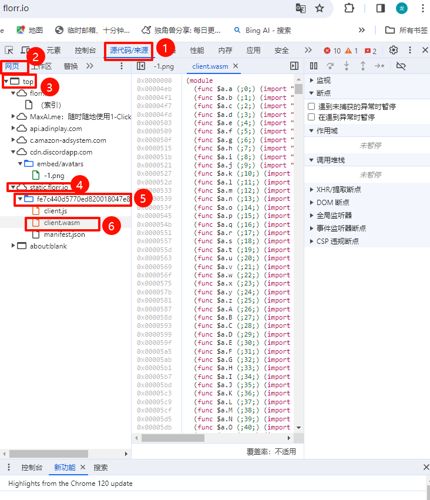
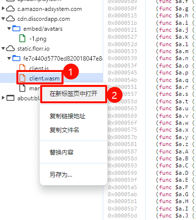
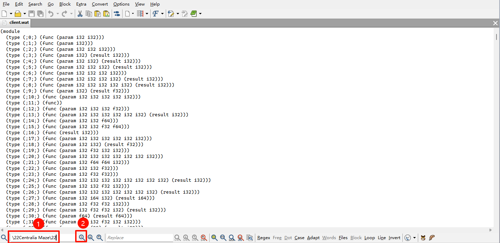

# 启用Florr中Maze的MiniMap功能教程
 


## 部署

从Github克隆：

```
git clone git@github.com:icer233/Florr_Maze_MiniMap_Mod.git
```

## 使用

1. 打开florr，`F12`打开开发者工具，选择`Sources`(`源代码/来源`)

2. 在下面点击`网页`

3. 依次展开`top`->`static.florr.io`->一串奇怪的字符串->`client.wasm`

   

4. 右键`client.wasm`, 选择`在新标签页中打开`(可能是英文), 下载`client.wasm`文件
   

5. 在本地运行`T01-wasm2wat.bat`并等待, 会得到一个`client.wat`文件

6. 用`T02-EditPadLite8.exe`打开`client.wat`

7. 在左下角搜索框中输入如下内容并搜索

   ```
   \22Centralia Maze\22
   ```
   

8. 点击蓝色部分并用右箭头移动光标, 找到如下内容

   ```
   {\0d\0a         \22name\22:\22minimap\22,\0d\0a         \22type\22:\22bool\22,\0d\0a         \22value\22:false\0d\0a        }
   ```

9. 将其中的`false`更改为`true`并`Ctrl+S`保存文件

10. 运行`T03-wat2wasm.bat`你将会得到`cli.wasm`文件

11. 打开`T04-mitmproxy`文件夹，将`cli.wasm`复制进去

12. 打开设置，搜索“代理”，“手动设置代理”，“设置”，代理IP写`127.0.0.1`，端口写`8080`，并把“使用代理服务器”开关打开

13. 访问`http://mitm.it/`，如果只看到一行英文说明操作错误，如果打开了按照提示安装Windows版本证书

14. 打开florr，运行`T04.bat`，刷新florr

## 提示

1. M28每更新一次游戏就需要重复一遍以上所有步骤，没有更新每次使用从第12步开始操作，使用完记得类比第12步关闭代理
2. 你可以在游戏中按下`；`再游戏右下角看到 **“Build”+日期** 这就是游戏版本

## 鸣谢

感谢 [WebAssembly/wabt](https://github.com/WebAssembly/wabt) 项目提供的`wat2wasm`、`wasm2wat`

感谢 [飞翔の小燕子](https://space.bilibili.com/495300593) 提供的方法以及技术支持

